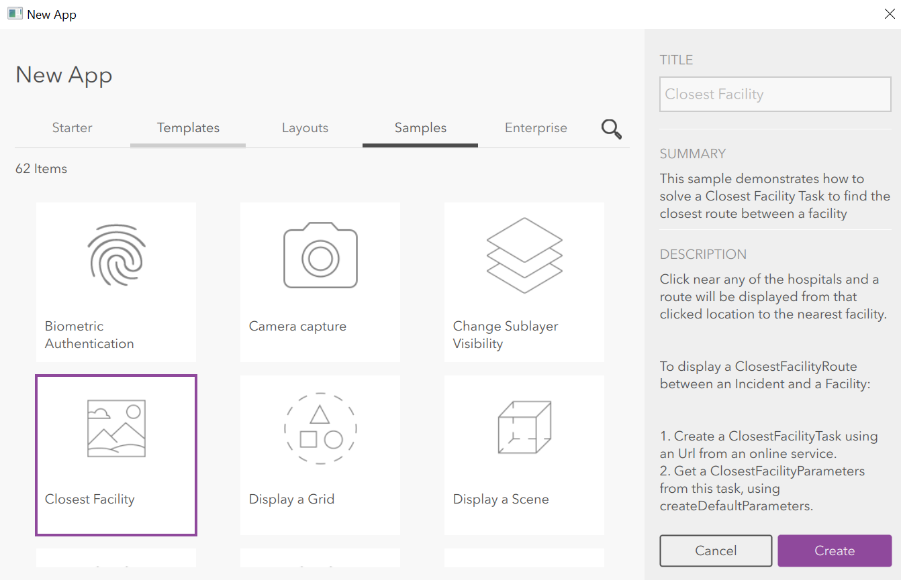

# Tutorial how to build Mobile App using Qt to find Closest Facility
# Lab4 

In case of emergency, time have a big role in saving lives. Therefore, it is important to identify the closest healthy facility from the incident which takes the minim time to arrive. Prerequisites To develop this Two_Maps screen, we have to have Esri online account and installed Esri App Studio on our machine. 

## Get your ESRI Online account and Login into ESRI App Studio

Once you get your account, go to https://www.esri.com/landing-pages/appstudio download and install Esri App Studio. Qt Creator (AppStudio for ArcGIS) will be installed with Esri App Studio. 

### Developing Closest Hospital finder Mobile app

1. Once the necessary applications are installed open Esri app studio on your desktop and login.
2. On upper right corner click New App On the Tittle give name of your app, I gave mine “Closest Hospital”. 
3. From the three items under Sample, select Closest Facility, then click on create to create your app. 



4. Now go to the gallery and refresh. You should see your newly created app in ESRI App studio gallery. 
5. Now we created a mobile app with one map screen with the default buttons and basemap (Topographic basemap).
6. After the app is created, we have to customize and make necessary changes according to our requirement.
The first step is to change the center of the map to our area of interest, in my case, I am working for Tacoma city. Therefore, my center is point is X= -122.44, Y= 47.25.
Before changing the viewpoint lets us as change the Basemap and Spatial reference

### Change the base Map and Spatial reference
Then check the BasemapLayer used. In such kind of purpose, Street data is more relavant. Therefore, set you basemap to Basemap Streets
The code is as follows; line 65 and 66

```
Map { BasemapStreets {}

```
We have to check the Spatial reference system used.  The default is web Mercator. In most cases our data might be different form web Mercator. For view point center I used WGS84. Therefore, lets change our spatial reference to WGS84
To do so use the following code: 

from
```
     spatialReference: SpatialReference.createWebMercator()
```
to
```
     spatialReference: SpatialReference.createWgs84()
```
### Change the View Point Center
change the center of the map to our area of interest, in my case, I am working for Tacoma city. Therefore, my center is point is 
X= -122.44, 
Y= 47.25
View point is set to be my new location as below

```
initialViewpoint: ViewpointCenter {
                        Point {
                            x: -122.44
                            y: 47.25
```
### Adding Facility (Hospitals) locations
The next part we do is inserting the point location of each facilities/Hospitals.
Insert point data each hospital by creating the graphic geometry as an example below. 
If you have many hospitals, you have to create as much number of hospitals you have.
The code to do this is: 
```
Graphic {
          geometry: Point {
                            x: -122.45254
                            y:  47.257
         spatialReference: SpatialReference.createWgs84()
```
Do this as many points/facilities you have

## Adding Network Data to the map:

To locating closest serve, the app uses road network data. This data can be stored on the server or on the device. In most cases mobile devices access data from server using internet. Let us assume we are pulling data from server. To do so, we have to 
Write the following code and change the url address by the url address where you stored your network data. In the example, the data come from ESRI rest service server. It is SanDiego city Road network data. 

I couldn't locate Tacoma city's network data,  I left the url link to the url of that of SanDiego. We have to replace this link with the url link of the data we are working on. 

```
ClosestFacilityTask {
                id: task
                url: "http://sampleserver6.arcgisonline.com/arcgis/rest/services/NetworkAnalysis/SanDiego/NAServer/ClosestFacility"

                onLoadStatusChanged: {
                    if (loadStatus !== Enums.LoadStatusLoaded)
                        return;

                    setupRouting();

                    function setupRouting() {
                        busy = true;
                        message = "";
                        task.createDefaultParameters();
                    }
                }

                onCreateDefaultParametersStatusChanged: {
                    if (createDefaultParametersStatus !== Enums.TaskStatusCompleted)
                        return;

                    busy = false;
                    facilityParams = createDefaultParametersResult;
                    facilityParams.setFacilities(facilities);
                }

                onSolveClosestFacilityStatusChanged: {
                    if (solveClosestFacilityStatus !== Enums.TaskStatusCompleted)
                        return;

                    busy = false;

                    if (solveClosestFacilityResult === null || solveClosestFacilityResult.error)
                        message = "Incident not within San Diego Area!";

                    var rankedList = solveClosestFacilityResult.rankedFacilityIndexes(0);
                    var closestFacilityIdx = rankedList[0];

                    var incidentIndex = 0; // 0 since there is just 1 incident at a time
                    var route = solveClosestFacilityResult.route(closestFacilityIdx, incidentIndex);

                    var routeGraphic = ArcGISRuntimeEnvironment.createObject(
                                "Graphic", { geometry: route.routeGeometry, symbol: routeSymbol});
                    resultsOverlay.graphics.append(routeGraphic);
                }

                onErrorChanged: message = error.message;
            }
```
### Save and test for Errors
Once you finished the code editing and writing
1. Save your code
2. Go to the apps gallery and open your app. If your app is built correctly, it will open, if there is error in your code, error message outlining the code line where the error occured and possible cause of error will be displayed. Read the causes of the error, go back to the code and fix it.
3. After fixing the error save your code and test it until you get rid of them. 

After finishing the above outlined steps, you will come up with mobile app having the basic functionality to find the closest hospital from a point. 

